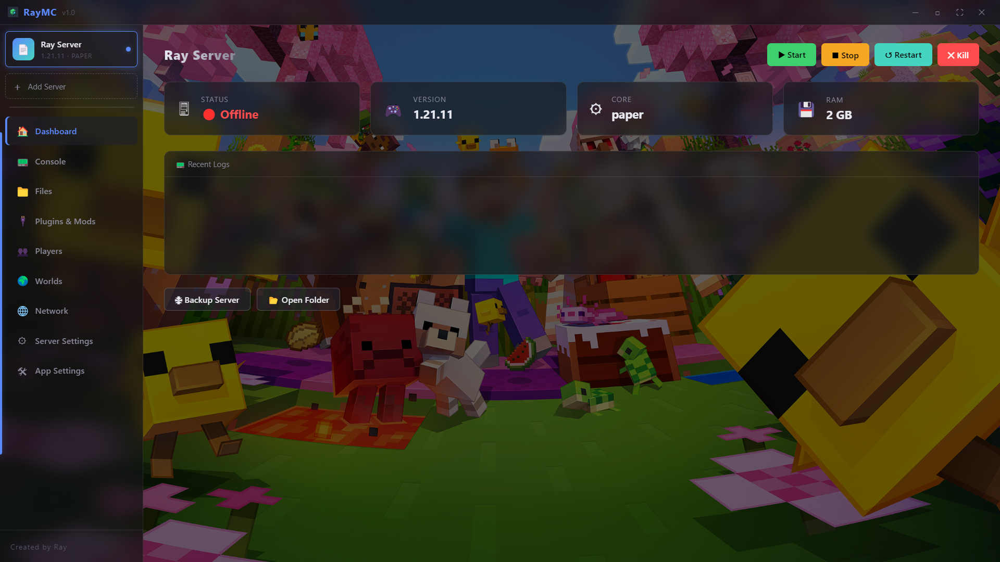
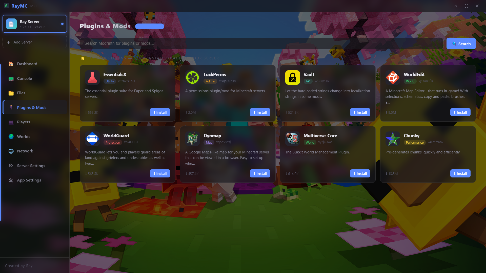
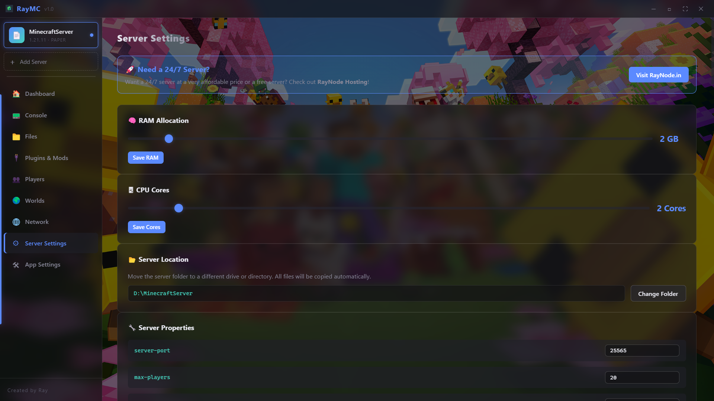

  
  
  # 🎮 RayMC Manager
  **The Ultimate, Modern, and High-Performance Local Minecraft Server Manager.**
  
  
  
  

 

Welcome to **RayMC Manager**, an all-in-one local server tool conceptualized and crafted by **Ray**. Stop messing around with boring batch files and complex port-forwarding setups. Manage your Minecraft servers straight from your desktop with a sleek, cinematic, and fully animated UI.

---

## ✨ Why Choose RayMC Manager?

* 🚀 **1-Click Server Wizard:** Instantly download and setup Vanilla, Paper, Forge, or Fabric.
* 🖥️ **Live Animated Console:** A real-time, stylized terminal for your server logs with Start/Stop/Kill controls.
* 🧩 **Integrated Modrinth Downloader:** Search and download plugins/mods directly into your server folder without opening a browser.
* 🌍 **Public Tunnels Made Easy:** Go public instantly with temporary SSH Tunnels (Pinggy) or Playit integrations.
* 🎨 **Deep Customization:** Built-in Dark/Light modes and custom PC background image support.
* ⚙️ **Smart Settings:** Auto-Java checker, visual `server.properties` editor, and RAM slider.

---

## 📸 Screenshots

Here is a sneak peek into the RayMC Manager experience:

### 🏠 Main Dashboard & Console
> *Real-time server logs with quick action controls.*

### 🧩 Plugins & Mods Downloader
> *Browse and install Modrinth plugins directly into your server.*

### ⚙️ Server Settings & UI Customization
> *Allocate RAM, edit server properties, and set your own cinematic background.*

*(Note: Click on the images to view them in full resolution.)*

---

## 📥 Installation Guide

Getting started is incredibly simple. You **do not** need Node.js or any complex developer tools to run this.

### Step 1: Download
1. Go to the [Releases Tab](../../releases/latest).
2. Download the latest `RayMC-Manager-Setup-X.X.X.exe` file.

### Step 2: Install
1. Double-click the downloaded `.exe` file.
2. Follow the beautiful Setup Wizard (Choose your install path and create a desktop shortcut).
3. Click **Install**.

### Step 3: Launch
1. Launch the app from your Desktop shortcut.
2. The app will automatically check if you have **Java** installed. If not, it will guide you.
3. Click the giant **"Create Server"** button and start playing!

---

## 🐛 Bug Reports & Feature Requests

RayMC Manager is constantly evolving. Found a bug? Have an amazing idea for a new feature? 
We'd love to hear from you!

👉 **[Open a New Issue](../../issues)**

---

  <i>Developed, Designed, and Maintained with passion by <b>Ray</b>.</i>

